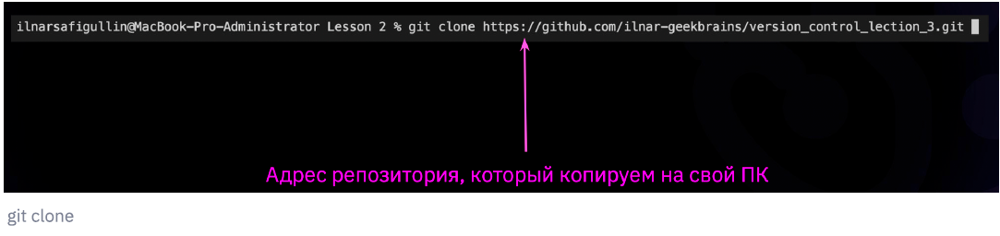
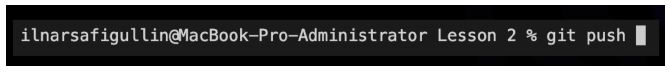

# Работа с удаленными репозиториями. Скачивание из текущего репозитория и слияние со своей версией

## *Освоение работы с удаленными репозиториями, которые находятся не на локальной, а на удаленной машине, например, на сервере.*

Копировать внешний репозиторий на свой ПК можно командой **git clone**.

Команда git clone составная: она не только
загружает все изменения, но и пытается слить
все ветки на локальном компьютере и в
удаленном репозитории.

**git push**

Отправить свою версию репозитория во
внешний репозиторий поможет команда **git
push**

* Эта команда позволяет отправить нашу
версию репозитория на внешний
репозиторий. ТРЕБУЕТ АВТОРИЗАЦИИ
на внешнем репозитории.

